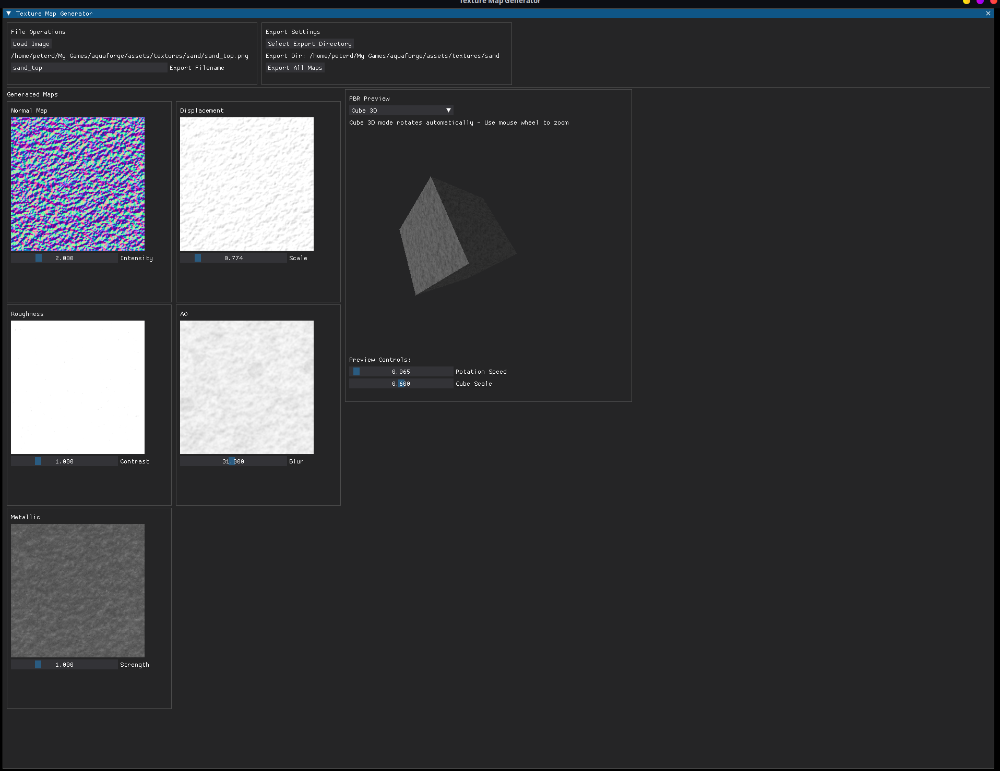

# Texture Map Generator

A powerful Python application for generating PBR (Physically Based Rendering) texture maps from a single input image. Perfect for game developers, 3D artists, and anyone working with materials and textures.

## Features

### Multiple Map Generation
- **Normal Maps** - Generate surface detail from height information
- **Displacement Maps** - Create actual geometry displacement
- **Roughness Maps** - Control surface roughness for realistic materials
- **Ambient Occlusion (AO)** - Add depth and shadow detail
- **Metallic Maps** - Define metallic vs non-metallic surfaces

### Real-time Preview Modes
- **Sphere Preview** - Classic material sphere with PBR lighting
- **Square Preview** - Flat surface with applied materials
- **Height Visualization** - 3D-like height representation
- **Cube 3D** - Rotating 3D cube with real-time material application

### Interactive Controls
- Real-time parameter adjustment with sliders
- Instant preview updates
- Customizable export settings
- Persistent configuration storage

### Export Features
- Export all maps simultaneously
- PNG format with high quality
- Custom filename support
- Organized file structure

## Installation

### Prerequisites
- Python 3.7 or higher
- pip package manager

### Setup
1. Clone the repository
2. Navigate to the project directory
3. Install dependencies using pip install -r requirements.txt
4. Run the application with python MapMaker.py

## Usage

### Basic Workflow
1. **Load Image**: Click "Load Image" and select your source texture (PNG, JPG, JPEG)
2. **Adjust Parameters**: Use the sliders to fine-tune each map type:
   - **Normal Intensity**: Controls the strength of surface details (0.1-8.0)
   - **Displacement Scale**: Adjusts height variation (0.1-5.0)
   - **Roughness Contrast**: Modifies surface roughness contrast (0.1-4.0)
   - **AO Blur**: Controls ambient occlusion blur radius (3.0-61.0)
   - **Metallic Strength**: Adjusts metallic map intensity (0.1-4.0)
3. **Preview**: Switch between preview modes to see your material in action
4. **Export**: Set export directory and filename, then click "Export All Maps"

### Preview Modes
- **Sphere**: Traditional material preview on a sphere with realistic lighting
- **Square**: Flat surface preview ideal for tiling textures
- **Height Viz**: Visualizes displacement as actual height differences
- **Cube 3D**: Animated rotating cube with real-time material application

### Export Options
The application exports five separate texture maps:
- filename_normal.png - Normal map (RGB)
- filename_displacement.png - Displacement/height map (Grayscale)
- filename_roughness.png - Roughness map (Grayscale)
- filename_ao.png - Ambient occlusion map (Grayscale)
- filename_metallic.png - Metallic map (Grayscale)

## Technical Details

### Algorithms Used
- **Normal Map Generation**: Sobel edge detection with configurable intensity
- **Displacement**: Gaussian blur with height scaling and visualization
- **Roughness**: Contrast enhancement with blur-based variation
- **Ambient Occlusion**: Morphological operations to detect cavities
- **Metallic**: Inverse-based metallic surface detection

### Performance
- Real-time processing at 30 FPS for 3D preview
- Optimized numpy operations for fast map generation
- Efficient memory usage with 256x256 working resolution
- Scalable preview system (400x400 default)

## Dependencies
- **dearpygui** (>=1.9.0) - Modern GUI framework
- **numpy** (>=1.21.0) - Numerical computing
- **Pillow** (>=9.0.0) - Image processing
- **opencv-python** (>=4.5.0) - Computer vision operations

## Configuration
The application automatically saves your preferences:
- Last used input directory
- Export directory location
- Window layout and settings

Configuration is stored in mapmaker_config.json in the application directory.

## Tips for Best Results

### Input Images
- Use high-contrast grayscale or color images
- Images with clear height variation work best for displacement
- Seamless/tileable textures produce better results
- Resolution: Any size (automatically resized to 256x256 for processing)

### Parameter Tuning
- **Normal Maps**: Start with intensity 2.0, adjust based on desired detail level
- **Displacement**: Lower values (0.5-1.5) for subtle effects, higher for dramatic height
- **Roughness**: 1.0 is neutral, higher values increase contrast
- **AO**: Larger blur values (31+) for softer shadows, smaller for sharp details
- **Metallic**: Adjust based on material type (lower for non-metals, higher for metals)

## Troubleshooting

### Common Issues
- **Blank previews**: Ensure an image is loaded first
- **Slow performance**: Try reducing preview update frequency or image complexity
- **Export errors**: Check that export directory exists and is writable
- **Missing maps**: Verify all sliders have been adjusted (triggers map generation)

### Performance Tips
- Close other applications for better 3D preview performance
- Use smaller source images for faster processing
- Disable cube rotation when not needed

## Contributing
Contributions are welcome! Please feel free to submit pull requests, report bugs, or suggest new features.

## License
This project is licensed under the MIT License.

## Acknowledgments
- Built with DearPyGui for the modern interface
- Uses OpenCV for advanced image processing
- Inspired by industry-standard PBR workflows

## Known issues
- The 3D cube is very laggy - It needs refining.
- UI needs some layout work.

---

Made with love for the 3D graphics community

If you find this tool useful, please consider giving it a star!